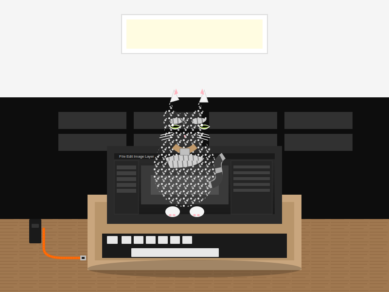
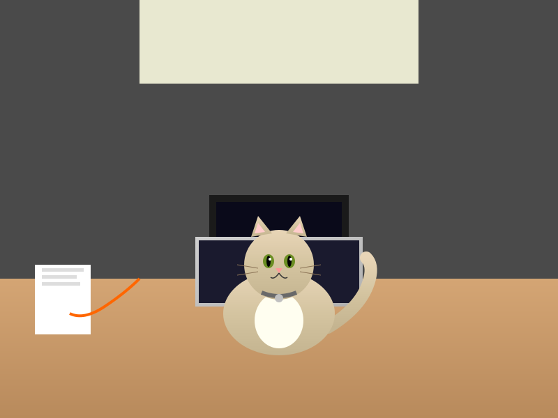
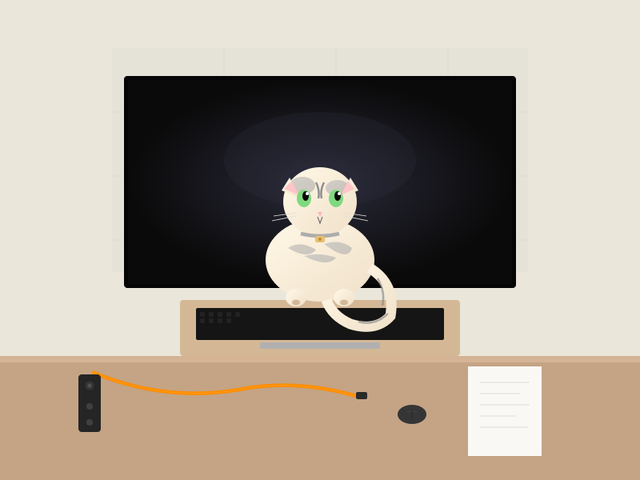

# Demo 1 — Qwen3.5-27B across 4 GPUs: Iterative SVG Generation

Same model (Qwen3.5-27B Q4_K_M), four different GPUs, same task, 10 minutes each.
Each GPU runs an independent AI agent that uses **native vision** to analyze a reference photograph, then iteratively reproduces it as SVG.

## GPUs

| GPU | VRAM | Context |
|-----|------|---------|
| NVIDIA RTX PRO 6000 Blackwell Max-Q (300W) | 96 GB | 131072 |
| NVIDIA GeForce RTX 5090 | 32 GB | 131072 |
| NVIDIA GeForce RTX 4090 | 24 GB | 131072 |
| NVIDIA GeForce RTX 3090 | 24 GB | 131072 |

All running:
- **Model:** Qwen3.5-27B-Q4_K_M.gguf with mmproj (vision enabled)
- **Server:** llama.cpp with `--jinja --chat-template-file qwen3.5_chat_template.jinja --mmproj mmproj-F32.gguf`
- **KV cache:** Q4_0 keys + Q4_0 values
- **Thinking:** Disabled via `chat_template_kwargs` proxy (for reliable tool calling)

## Reference Image


*A cat (Devon Rex) sitting on a laptop keyboard in a workspace.*

## Task

Each agent:
1. Sends the reference JPG to its own model endpoint using the OpenAI vision content array format (native multimodal — no external API)
2. Writes an SVG reproduction
3. Sends the SVG back to the model for visual comparison
4. Improves and repeats until killed at 10 minutes

## Results

### SVG Output (after 10 minutes)

<table>
<tr>
<td align="center"><strong>RTX PRO 6000 Max-Q</strong><br>(19 iterations)</td>
<td align="center"><strong>RTX 5090</strong><br>(21 iterations)</td>
<td align="center"><strong>RTX 4090</strong><br>(13 iterations)</td>
<td align="center"><strong>RTX 3090</strong><br>(14 iterations)</td>
</tr>
<tr>
<td></td>
<td></td>
<td></td>
<td></td>
</tr>
</table>

### Performance Metrics

Collected via `nvidia-smi` (power, utilization) and llama.cpp `/slots` (token throughput) polled every 2 seconds during the 10-minute run.

| Metric | RTX PRO 6000 Max-Q | RTX 5090 | RTX 4090 | RTX 3090 |
|--------|:------------:|:--------:|:--------:|:--------:|
| **Iterations completed** | 19 | **21** | 13 | 14 |
| **TPS (avg)** | 49.3 | **60.2** | 42.7 | 33.9 |
| TPS (median) | 48.8 | 59.7 | 42.5 | 33.4 |
| TPS (max) | 63.2 | 74.0 | 64.0 | 44.7 |
| **Power avg (W)** | **292** | 550 | 366 | 333 |
| Power max (W) | 303 | 593 | 394 | 343 |
| Power idle (W) | 11 | 32 | 26 | 5 |
| GPU utilization (avg) | 92% | 90% | 95% | 96% |
| GPU utilization (max) | 99% | 98% | 100% | 100% |
| VRAM used (MiB) | ~19,559 | ~19,159 | ~18,916 | ~18,632 |

### Tokens per Watt

| GPU | tok/s | Avg Power (W) | **Tokens per Watt** |
|-----|------:|:-------------:|:-------------------:|
| RTX PRO 6000 Max-Q | 49.3 | 292 | **0.169** |
| RTX 5090 | 60.2 | 550 | 0.109 |
| RTX 4090 | 42.7 | 366 | 0.117 |
| RTX 3090 | 33.9 | 333 | 0.102 |

The RTX PRO 6000 Max-Q (300W TDP) delivers **55% more tokens per watt** than the 5090 and **44% more** than the 4090.

### Key Takeaways

- **RTX 5090** is the fastest at 60.2 tok/s average and completed the most iterations (21), but draws 550W average — nearly double the RTX PRO 6000.
- **RTX PRO 6000 Max-Q** delivers 49.3 tok/s at only 292W average — best **tokens per watt** efficiency by a large margin.
- **RTX 4090** holds up well at 42.7 tok/s on a consumer card.
- **RTX 3090** at 33.9 tok/s is the slowest but still completed 14 iterations with meaningful SVG output.
- All GPUs saturate at 90-96% utilization — the workload is fully GPU-bound.
- Vision requests (sending/analyzing images) add ~12-22s overhead per iteration depending on GPU speed.

## Infrastructure

```
  Agent 1 ──► nothink proxy ──► llama.cpp + mmproj (RTX PRO 6000)
  Agent 2 ──► nothink proxy ──► llama.cpp + mmproj (RTX 5090)
  Agent 3 ──► nothink proxy ──► llama.cpp + mmproj (RTX 4090)
  Agent 4 ──► nothink proxy ──► llama.cpp + mmproj (RTX 3090)
                                     │
  metrics_collector.py ── polls nvidia-smi + /slots ─┘
```

- **Agent orchestration:** [Hermes Agent](https://github.com/nousresearch/hermes-agent) CLI with isolated config per agent
- **Vision:** Native multimodal via OpenAI content arrays sent directly to llama.cpp (no external API)
- **NoThink proxy:** Injects `chat_template_kwargs: {enable_thinking: false}` for reliable tool calling
- **Metrics:** Sidecar polling `nvidia-smi` and llama.cpp `/slots` every 2s

## Reproduce

See `framework/` for the launcher, proxies, metrics collector, and live viewer.
See `services/` for the systemd unit files.

```bash
cd demo-1/framework
HOST_A=<gpu-host-1> HOST_B=<gpu-host-2> DURATION=600 ./launch_agents.sh
```
