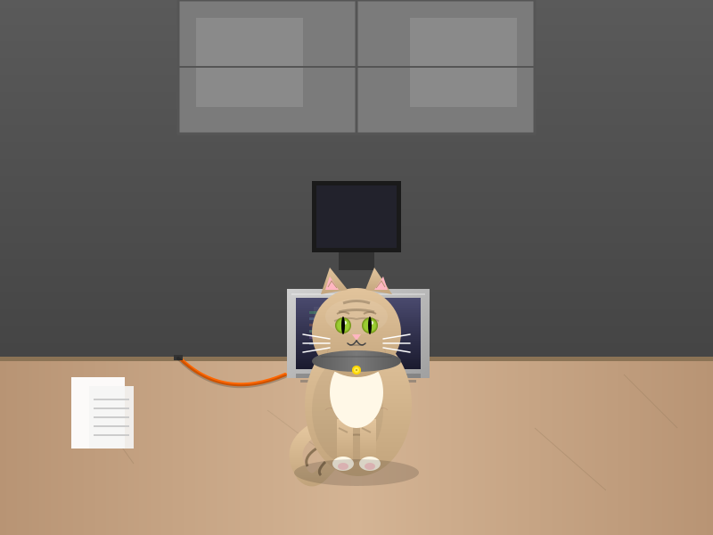
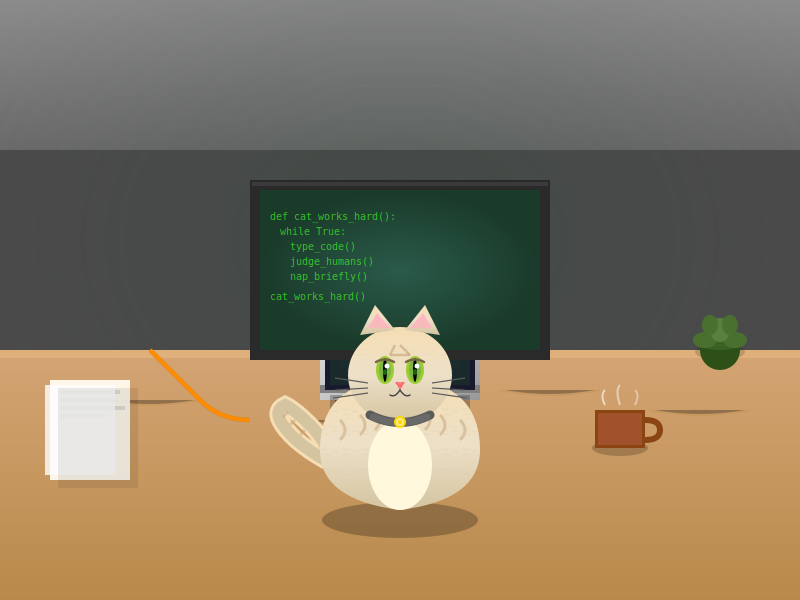
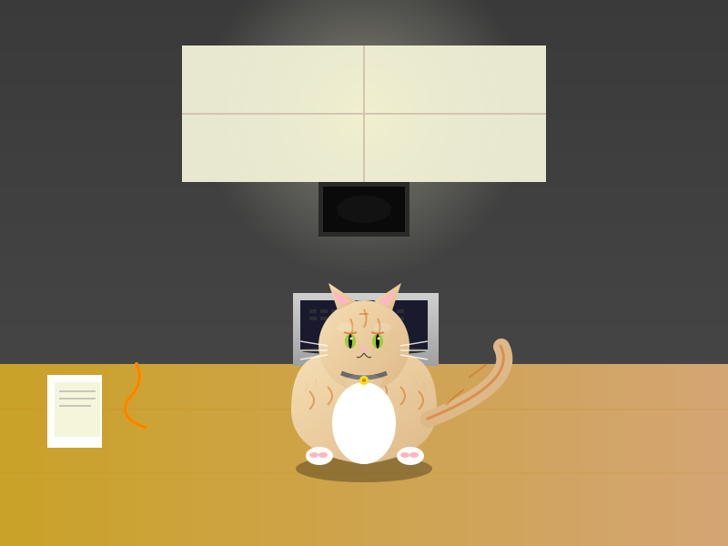
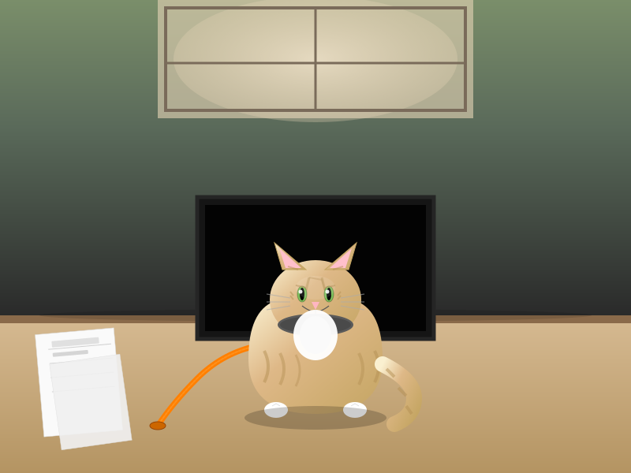

# Demo 2 — Highest Practical Qwen3.5 per GPU: Iterative SVG Generation (Vision)

Each GPU runs the **largest Qwen3.5 model it can fit** at 131K context, same task, 10 minutes each.
Each agent uses **native vision** to analyze the reference photograph, then iteratively reproduces it as SVG.

## GPUs & Models

| GPU | VRAM | Model | Quant |
|-----|------|-------|-------|
| RTX PRO 6000 Max-Q (300W) | 48 GB | Qwen3.5-122B-A10B | Q4_K_M |
| RTX 5090 | 32 GB | Qwen3.5-27B | Q5_K_M |
| RTX 4090 | 24 GB | Qwen3.5-27B | Q4_K_M |
| RTX 3090 | 24 GB | Qwen3.5-27B | Q4_K_M |

All running:
- **Server:** llama.cpp with `--jinja --chat-template-file qwen3.5_chat_template.jinja --mmproj mmproj-F16.gguf`
- **Context:** 131072 tokens
- **KV cache:** Q4_0 keys + Q4_0 values
- **Thinking:** Disabled via `chat_template_kwargs` proxy

## Reference Image


*A cat (Devon Rex) sitting on a laptop keyboard in a workspace.*

## Task

Each agent:
1. Sends the reference JPG to its own model endpoint using the OpenAI vision content array format (native multimodal)
2. Writes an SVG reproduction
3. Sends the SVG back to the model for visual comparison
4. Improves and repeats until killed at 10 minutes

## Results

### SVG Output (after 10 minutes)

<table>
<tr>
<td align="center"><strong>RTX PRO 6000 Max-Q</strong><br>122B Q4_K_M<br>(19 iterations)</td>
<td align="center"><strong>RTX 5090</strong><br>27B Q5_K_M<br>(21 iterations)</td>
<td align="center"><strong>RTX 4090</strong><br>27B Q4_K_M<br>(18 iterations)</td>
<td align="center"><strong>RTX 3090</strong><br>27B Q4_K_M<br>(22 iterations)</td>
</tr>
<tr>
<td></td>
<td></td>
<td></td>
<td></td>
</tr>
</table>

### Performance Metrics

Collected via `nvidia-smi` (power, utilization) and llama.cpp `/slots` (token throughput) polled every 2 seconds during the 10-minute run.

| Metric | RTX PRO 6000 Max-Q (122B) | RTX 5090 (27B Q5) | RTX 4090 (27B Q4) | RTX 3090 (27B Q4) |
|--------|:-------------------------:|:-----------------:|:-----------------:|:-----------------:|
| **Iterations completed** | 19 | 21 | 18 | **22** |
| **TPS (avg)** | **71.9** | 55.0 | 42.9 | 33.5 |
| TPS (median) | 71.7 | 54.9 | 42.8 | 33.0 |
| TPS (max) | 105.5 | 76.5 | 61.4 | 48.4 |
| **Power avg (W)** | **292** | 553 | 367 | 316 |
| Power max (W) | 304 | 594 | 445 | 342 |
| Power idle (W) | 33 | 29 | 26 | 4 |
| GPU utilization (avg) | 90% | 91% | 94% | 87% |
| GPU utilization (max) | 99% | 99% | 100% | 100% |

### Tokens per Watt

| GPU | Model | tok/s | Avg Power (W) | **Tokens per Watt** |
|-----|-------|------:|:-------------:|:-------------------:|
| RTX PRO 6000 Max-Q | 122B Q4_K_M | 71.9 | 292 | **0.246** |
| RTX 5090 | 27B Q5_K_M | 55.0 | 553 | 0.099 |
| RTX 4090 | 27B Q4_K_M | 42.9 | 367 | 0.117 |
| RTX 3090 | 27B Q4_K_M | 33.5 | 316 | 0.106 |

The RTX PRO 6000 Max-Q (300W TDP) running the **122B MoE model** delivers **2.5x more tokens per watt** than the 5090 running 27B, while also being the fastest in raw tok/s.

### Key Takeaways

- **122B-A10B on RTX PRO 6000 Max-Q** is the surprise winner — 71.9 tok/s average, faster than all 27B instances. The MoE architecture (10B active parameters) runs efficiently on the 48GB card at only 292W.
- **RTX 5090 with Q5_K_M** is second at 55.0 tok/s but draws nearly double the power (553W).
- **RTX 3090** completed the most iterations (22) despite being the slowest in tok/s — the 27B Q4 model generates shorter responses, allowing more round-trips.
- The 122B model achieves **0.246 tokens per watt** — best efficiency by a wide margin, demonstrating that MoE models are exceptionally power-efficient for inference.
- Vision overhead is consistent across all models (~12-20s for image analysis per iteration).

## Infrastructure

```
  Agent 1 ──► nothink proxy ──► llama.cpp + mmproj (122B Q4 on RTX PRO 6000 Max-Q)
  Agent 2 ──► nothink proxy ──► llama.cpp + mmproj (27B Q5 on RTX 5090)
  Agent 3 ──► nothink proxy ──► llama.cpp + mmproj (27B Q4 on RTX 4090)
  Agent 4 ──► nothink proxy ──► llama.cpp + mmproj (27B Q4 on RTX 3090)
                                     │
  metrics_collector.py ── polls nvidia-smi + /slots ─┘
```

- **Agent orchestration:** [Hermes Agent](https://github.com/nousresearch/hermes-agent) CLI with isolated config per agent
- **Vision:** Native multimodal via OpenAI content arrays sent directly to llama.cpp
- **NoThink proxy:** Injects `chat_template_kwargs: {enable_thinking: false}` for reliable tool calling
- **Metrics:** Sidecar polling `nvidia-smi` and llama.cpp `/slots` every 2s

## Reproduce

See `framework/` for the launcher, proxies, metrics collector, and live viewer.
See `services/` for the systemd unit files.

```bash
cd demo-2/framework
HOST_A=<gpu-host-1> HOST_B=<gpu-host-2> DURATION=600 ./launch_agents.sh
```
