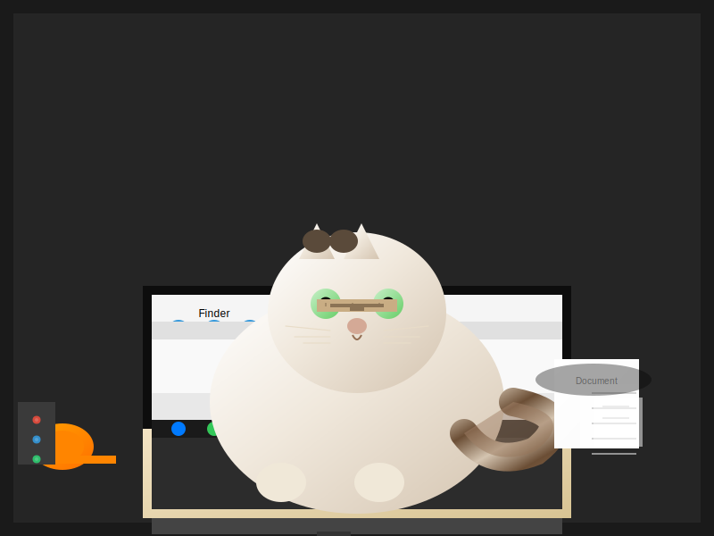

# Demo 3 — Qwen3.5-9B across 4 GPUs: Iterative SVG Generation (Vision)

Same model (Qwen3.5-9B Q4_K_M), four different GPUs, same task, 10 minutes each.
Each GPU runs an independent AI agent that uses **native vision** to analyze a reference photograph, then iteratively reproduces it as SVG.

## GPUs

| GPU | VRAM | Context |
|-----|------|---------|
| NVIDIA RTX PRO 6000 Max-Q (300W) | 96 GB | 131072 |
| NVIDIA GeForce RTX 5090 | 32 GB | 131072 |
| NVIDIA GeForce RTX 4090 | 24 GB | 131072 |
| NVIDIA GeForce RTX 3090 | 24 GB | 131072 |

All running:
- **Model:** Qwen3.5-9B-Q4_K_M.gguf with mmproj (vision enabled)
- **Server:** llama.cpp with `--jinja --chat-template-file qwen3.5_chat_template.jinja --mmproj mmproj-F16.gguf`
- **KV cache:** Q4_0 keys + Q4_0 values
- **Thinking:** Disabled via `chat_template_kwargs` proxy (for reliable tool calling)

## Reference Image


*A cat (Devon Rex) sitting on a laptop keyboard in a workspace.*

## Task

Each agent:
1. Sends the reference JPG to its own model endpoint using the OpenAI vision content array format (native multimodal — no external API)
2. Writes an SVG reproduction
3. Sends the SVG back to the model for visual comparison
4. Improves and repeats until killed at 10 minutes

## Results

### SVG Output (after 10 minutes)

<table>
<tr>
<td align="center"><strong>RTX PRO 6000 Max-Q</strong><br>(33 turns, 10 writes)</td>
<td align="center"><strong>RTX 5090</strong><br>(13 turns, 4 writes)</td>
<td align="center"><strong>RTX 4090</strong><br>(92 turns, 5 writes)</td>
<td align="center"><strong>RTX 3090</strong><br>(25 turns, 7 writes)</td>
</tr>
<tr>
<td></td>
<td></td>
<td></td>
<td></td>
</tr>
</table>

### Performance Metrics

Collected via `nvidia-smi` (power, utilization) and llama.cpp `/slots` (token throughput) polled every 2 seconds during the 10-minute run.

| Metric | RTX PRO 6000 Max-Q | RTX 5090 | RTX 4090 | RTX 3090 |
|--------|:------------------:|:--------:|:--------:|:--------:|
| **Turns (LLM calls)** | 33 | 13 | **92** | 25 |
| **SVG writes** | **10** | 4 | 5 | 7 |
| **TPS (avg)** | 128.7 | **154.8** | 109.9 | 90.7 |
| TPS (median) | 134.2 | 170.2 | 119.3 | 90.7 |
| TPS (max) | 162.6 | 186.8 | 168.1 | 120.8 |
| **Power avg (W)** | **159** | 73 | 225 | 189 |
| Power max (W) | 307 | 542 | 379 | 342 |
| GPU utilization (avg) | 43% | 10% | 54% | 47% |
| GPU utilization (max) | 99% | 100% | 99% | 100% |

### Tokens per Watt

| GPU | tok/s | Avg Power (W) | **Tokens per Watt** |
|-----|------:|:-------------:|:-------------------:|
| RTX PRO 6000 Max-Q | 128.7 | 159 | **0.809** |
| RTX 5090 | 154.8 | 73 | **2.120** |
| RTX 4090 | 109.9 | 225 | 0.489 |
| RTX 3090 | 90.7 | 189 | 0.480 |

### Key Takeaways

- **9B is dramatically faster** than 27B — 90-170 tok/s vs 34-72 tok/s. The smaller model generates tokens 2-3x faster.
- **RTX 5090** achieves the highest raw TPS (154.8 avg, 186.8 peak) and best tokens-per-watt (2.12) — the 9B model is so small that it barely loads the GPU (10% avg utilization, 73W avg power).
- **GPU utilization is much lower** than with 27B models (10-54% vs 87-96%), showing the 9B model doesn't saturate any of these GPUs. The cards spend most of their time idle between requests.
- **RTX 4090 had 92 turns** but only 5 SVG writes — the model was making many small LLM calls (analysis, planning) between writes. Turn count ≠ write count for the 9B model.
- **Quality tradeoff**: Despite more iterations, the 9B model produces simpler SVGs than the 27B — smaller models have less capacity for complex spatial reasoning and SVG code generation.
- The 9B model is **massively overpowered** on these GPUs. Even the RTX 3090 runs it at 90+ tok/s with room to spare. These cards are designed for much larger models.

## Infrastructure

```
  Agent 1 ──► nothink proxy ──► llama.cpp + mmproj (9B Q4 on RTX PRO 6000 Max-Q)
  Agent 2 ──► nothink proxy ──► llama.cpp + mmproj (9B Q4 on RTX 5090)
  Agent 3 ──► nothink proxy ──► llama.cpp + mmproj (9B Q4 on RTX 4090)
  Agent 4 ──► nothink proxy ──► llama.cpp + mmproj (9B Q4 on RTX 3090)
                                     │
  metrics_collector.py ── polls nvidia-smi + /slots ─┘
```

- **Agent orchestration:** [Hermes Agent](https://github.com/nousresearch/hermes-agent) CLI with isolated config per agent
- **Vision:** Native multimodal via OpenAI content arrays sent directly to llama.cpp
- **NoThink proxy:** Injects `chat_template_kwargs: {enable_thinking: false}` for reliable tool calling
- **Metrics:** Sidecar polling `nvidia-smi` and llama.cpp `/slots` every 2s

## Reproduce

See `framework/` for the launcher, proxies, metrics collector, and live viewer.
See `services/` for the systemd unit files.

```bash
cd demo-3/framework
HOST_A=<gpu-host-1> HOST_B=<gpu-host-2> DURATION=600 ./launch_agents.sh
```
