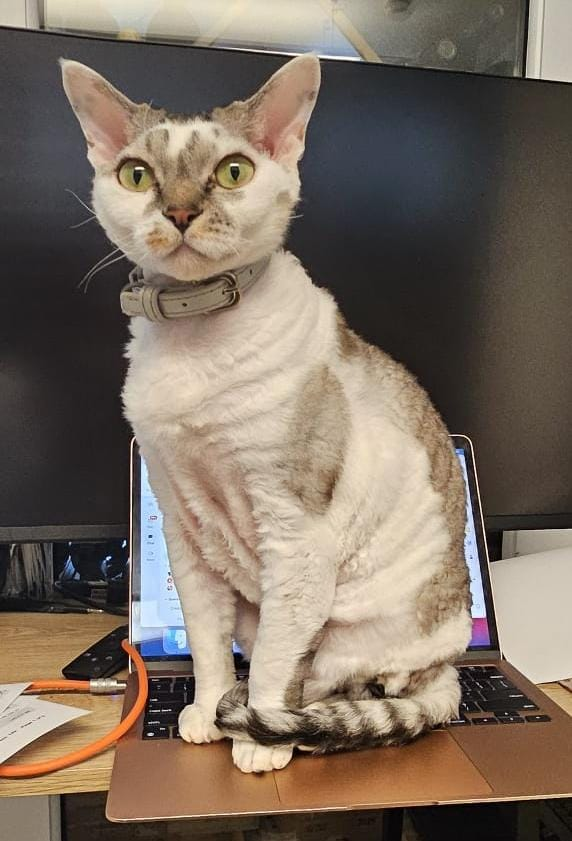
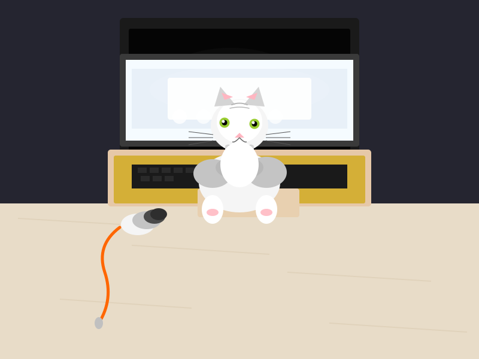

# Demo 4 — Split Models across GPU Pairs: Iterative SVG Generation (Vision)

Each host pair runs a **tensor-parallel split** of the highest quality quantization:
- **pg1** (RTX PRO 6000 Max-Q + RTX 5090): Qwen3.5-122B-A10B UD-Q6_K_XL
- **turqette** (RTX 4090 + RTX 3090): Qwen3.5-27B Q6_K

Each agent uses **native vision** to analyze a reference photograph, then iteratively reproduces it as SVG. 10 minutes per run.

## GPUs & Models

| GPU Pair | GPUs | VRAM (combined) | Model | Quant | Tensor Split |
|----------|------|-----------------|-------|-------|:------------:|
| pg1 | RTX PRO 6000 Max-Q + RTX 5090 | 48 + 32 = 80 GB | Qwen3.5-122B-A10B | UD-Q6_K_XL | 3:1 |
| turqette | RTX 4090 + RTX 3090 | 24 + 24 = 48 GB | Qwen3.5-27B | Q6_K | 1:1 |

All running:
- **Server:** llama.cpp with `--jinja --chat-template-file qwen3.5_chat_template.jinja --mmproj mmproj-F16.gguf`
- **Context:** 131072 tokens
- **KV cache:** Q4_0 keys + Q4_0 values
- **Thinking:** Disabled via `chat_template_kwargs` proxy

## Reference Image



*A cat (Devon Rex) sitting on a laptop keyboard in a workspace.*

## Task

Each agent:
1. Sends the reference JPG to its own model endpoint using the OpenAI vision content array format (native multimodal)
2. Writes an SVG reproduction
3. Sends the SVG back to the model for visual comparison
4. Improves and repeats until killed at 10 minutes

## Results

### SVG Output (after 10 minutes)

<table>
<tr>
<td align="center"><strong>122B Q6 Split</strong><br>RTX PRO 6000 Max-Q + RTX 5090<br>(17 turns, 7 writes)</td>
<td align="center"><strong>27B Q6 Split</strong><br>RTX 4090 + RTX 3090<br>(17 turns, 6 writes)</td>
</tr>
<tr>
<td></td>
<td></td>
</tr>
</table>

### Performance Metrics

Collected via `nvidia-smi` (power, utilization) per GPU and llama.cpp `/slots` (token throughput) polled every 2 seconds during the 10-minute run.

**122B Q6 Split (RTX PRO 6000 Max-Q + RTX 5090)**

| Metric | RTX PRO 6000 Max-Q | RTX 5090 | Combined |
|--------|:------------------:|:--------:|:--------:|
| **TPS (avg)** | — | — | **60.8** |
| TPS (median) | — | — | 60.8 |
| TPS (max) | — | — | 76.3 |
| **Power avg (W)** | 258 | 151 | **409** |
| Power max (W) | 292 | 163 | 455 |
| GPU utilization (avg) | 60% | 21% | — |

**27B Q6 Split (RTX 4090 + RTX 3090)**

| Metric | RTX 4090 | RTX 3090 | Combined |
|--------|:--------:|:--------:|:--------:|
| **TPS (avg)** | — | — | **29.6** |
| TPS (median) | — | — | 29.5 |
| TPS (max) | — | — | 53.2 |
| **Power avg (W)** | 202 | 296 | **498** |
| Power max (W) | 212 | 307 | 519 |
| GPU utilization (avg) | 40% | 52% | — |

### Tokens per Watt

| Config | tok/s | Combined Power (W) | **Tokens per Watt** |
|--------|------:|:-------------------:|:-------------------:|
| 122B Q6 Split (6000+5090) | 60.8 | 409 | **0.149** |
| 27B Q6 Split (4090+3090) | 29.6 | 498 | 0.059 |

The 122B split delivers **2.5x more tokens per watt** than the 27B split, and is **2x faster** in raw tok/s.

### Key Takeaways

- **122B MoE split** at 60.8 tok/s is remarkably fast — comparable to a single-GPU 27B Q5 (55 tok/s from demo-2), while running a 4.5x larger model across two GPUs.
- **Tensor split overhead is minimal** — the 6000 does 60% of the work (3:1 split ratio), while the 5090 idles at 21% utilization. The 6000 is the bottleneck.
- **27B Q6 split** at 29.6 tok/s is slower than single-GPU 27B Q4 (42.9 tok/s) — the inter-GPU communication overhead hurts more than the quality gain from Q6 quantization.
- **The 3090 is the bottleneck** in the 27B split — 52% utilization and 296W vs the 4090's 40% and 202W, suggesting the 3090's slower PCIe bus limits transfer speed.
- Both configs completed exactly 17 turns each, suggesting the task (vision + SVG generation) scales consistently regardless of model speed — the bottleneck shifts to the vision analysis overhead.

## Infrastructure

```
  Agent 1 ──► nothink proxy ──► llama.cpp + mmproj (122B Q6, split 6000+5090)
  Agent 2 ──► nothink proxy ──► llama.cpp + mmproj (27B Q6, split 4090+3090)
                                     │
  metrics_collector.py ── polls nvidia-smi (all 4 GPUs) + /slots ─┘
```

- **Agent orchestration:** [Hermes Agent](https://github.com/nousresearch/hermes-agent) CLI with isolated config per agent
- **Vision:** Native multimodal via OpenAI content arrays sent directly to llama.cpp
- **NoThink proxy:** Injects `chat_template_kwargs: {enable_thinking: false}` for reliable tool calling
- **Metrics:** Sidecar polling `nvidia-smi` and llama.cpp `/slots` every 2s

## Reproduce

See `framework/` for the launcher, proxies, metrics collector, and live viewer.
See `services/` for the systemd unit files.

```bash
cd demo-4/framework
HOST_A=<gpu-host-1> HOST_B=<gpu-host-2> DURATION=600 ./launch_agents.sh
```
